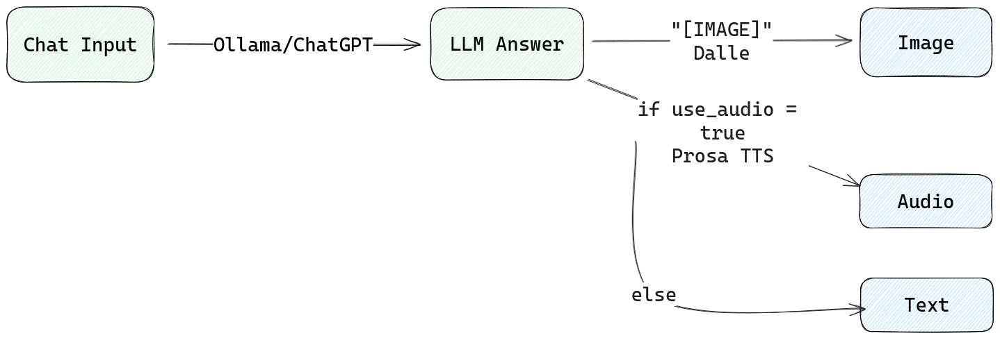

## Setup

```bash
go install github.com/a-h/templ/cmd/templ@latest
```

## Running

```bash
go mod tidy
templ generate

export OLLAMA_URL=""
go run ./cmd/*
```

Then open the homepage at http://localhost:3000 or http://localhost:3000/summary for summarization.

## Chat App Flow



## Summary App Flow


